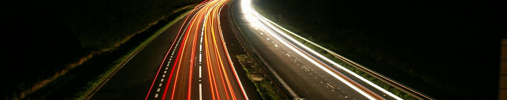
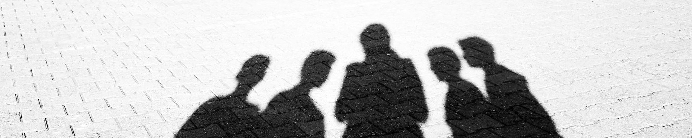
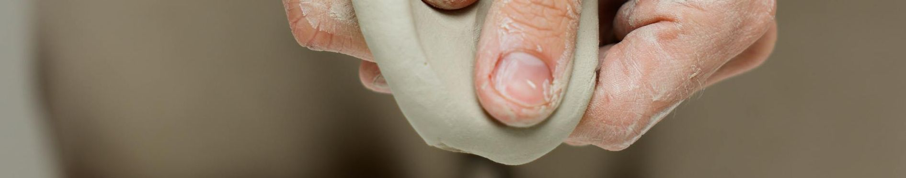

# CS 4620/8626 - Fall 2027 - Topics
These are the topics we are going to cover in class each day. Links to [example student videos ](https://www.youtube.com/playlist?list=PLH9qo0GKu2iQgPuzozltIuvLgEddxc43L) 

# Day 07 - September 17 - Animation of Rigid Bodies [Blender] (🧑‍🏫Lecture 6)

## 🏛️Module: [The Last Star Fighter](./modules/The%20Last%20Star%20Fighter.md)

## 🏛️Module: [Disney and Animation](./modules/Disney%20and%20Animation.md)

## 👩‍💻Module: [Rigid Body Animation - Basics](./modules/Rigid%20Body%20Animation%20-%20Basics.md)

## 👩‍💻Module: [Rigid Body Animation - Advanced](./modules/Rigid%20Body%20Animation%20-%20Advanced.md)

# Day 06 - September 15  (👟Sprint 1)

## 🏛️👩‍💻Module: [Open Shader Language](./modules/Open%20Shader%20Language.md)

# Day 05 - September 10 - Shading 2 [Blender] (🧑‍🏫Lecture 5)

## 💡New Idea: Lighting is important to story telling
  - Look at different clips from videos. How is lighting use to tell a story or set a mood?

## 💡New Idea: Ambient Lighting
- Light is always bouncing around us. Ambient lighting is a 'fudge' term that tries to capture this reflected light.

## 👩‍💻Activity: Ambient Light
- Adjust the ambient lighting in Blender

> [!Tip] History Moment
> Early FPS games only used ambient lighting. For example look at Wolfenstein 3D, the predecessor to Doom. 

## 💡New Idea: Diffuse Lighting
- How does light reflect at an atomic level?
- How does the angle to a light affect the amount of diffuse lighting?
  - Talk about sun burns and seasons
- The difference between a surface's normal and the direction to the light source determine the amount of illumination
  - The normal of a surface is the vector that is perpendicular to the tangent of the surface
- The difference between normals can be found by calculating the dot product between them.

## 👩‍💻Activity: Add Diffuse Lighting in Blender
- Look at different light types
  - Spot
  - Sun
  - Point
  - Area
    - Why do area lights cause noise in the rendered image?

## How to add color to objects in blender
- Base colors (diffuse)
- Specular highlights (roughness)

## Shading in Blender
- Different shading views in main view
- Changing ambient light in the world tab
- Adding a material to a mesh

## Shader tab in Blender
- Visual scripting
- Pins and wires
- Add ambient, diffuse, and specular (glossy) shaders
- Example of a diffuse shader in Blender
- 
- 

## Normals on Objects
  - Different kinds of shading in Blender (smooth v flat)
  - Normals as an attribute of vertices gives us a way to hint at the curvature of a surface.

# Day 04 - September 03 - Shading 1 [Blender] (🧑‍🏫Lecture 4)

<!-- ## 🔙Review
- Consider vector A (1, 0, 0) and vector B(1, 1, 0)
- What is A cross B?
- What is A dot B?
- What is the length of A?
- What is the length of B? -->

## Texturing
Wrapping paper
Activity: Wrapping paper

Wrapping maps
Activity, Reviewing mapping projections
For example, see how maps are distorted with this website: 
https://thetruesize.com/

Look at the Wolfenstein 3D. This game uses very simple texture maps in an early  ray traced game.

## Blender UV Activity
- Look at the UV maps for a sphere
- UV map projections
- Save UV map outlines for space ship
- Show how to save texture maps for exporting

<!-- ## Different renderers
  
## Math Starter
- Normalize vectors
- Interpolate normals across a triangle

## Interpolate normal
Barycentric coordinates
- See calculator -->

## Actual texture maps
- Look at the texture map of a head online

# Barycentric

- We can use Barycentric coordinates to go back and forth between the $x$, $y$, and $z$ coordinates of a position on a 3D triangle and the  the $u$ and $v$ coordinates on a 2D texture.

- Let's consider a triangle with points at $(0,0,0)$, $(6,0,0)$, and $(0,6,0)$. Note that this triangle is intentionally two-dimensional to help in visualizing this process. The math is the same for any arbitrary triangle, however

- Start by calculating the area of the triangle. The vectors that define the two legs are $(6,0,0)$ and $(0,6,0)$

- The cross product of these two vectors gives us the area of the parallelagram defined by the vectors. If we divide that amount by two, we get the area of the triangle.
   - $(6,0,0)\times(0,6,0)$
   - $x=0-0$
   - $y=0-0$
   - $z=36-0=36$
   - The length of the vector $(0,0,36)$ is $\sqrt{0^2+0^2+36^2}=36$
   - Thus the triangle Area = $36/2=18$

- If  the point in question is $P=(2,2,0)$, then we can calculate the $u,v$ coordinate as folows
   - $u=(P-B)\times (P-C)/36$
   - $v=(P-A)\times (P-C)/36$
   - $w=1-u-v$
   - $u=((-4,2,0)\times (2, -4,0))/36$
   - $v=((2, 2, 0)\times (2, -4,0))/36$
   - $w=1-u-v$

- This website interactively shows you how Barycentric coordinates change as you move the point in question: https://polygonalcube.itch.io/barycentric-coordinates-visualization

## Professional software
- Substance 3D
- Activity: Review Substance 3D demoreel/website https://www.youtube.com/watch?v=TzMHqw0Qp-s
- Activity: Look at texture painting in Blender, which is a simple version of Substance 3D

<!-- ## Normal maps -->

# Day 03 - September 01 - Rendering [Blender] (🧑‍🏫Lecture 3)

# Traditional Rendering
- Look at how Disney originally rendered their animations here: https://www.youtube.com/watch?v=vjDry9Q0P4Q
- Then look at how they improved their rendering here: https://www.youtube.com/watch?v=YdHTlUGN1zw
- What limitations did the first approach have? What limitations did the second approach have? If a rendering approach cannot theoretically produce the same results as a perfect photograph, then the difference between what it can do and perfection is called bias.
- Rasterizers are biased renderers because they have theoretical limits to what they can do
- Ray tracers are unbiased because they do not have these theoretical limits.

> [!Tip] History Moment
>
> Here is a look at how games on PC and console diverged and remerged around 3D Graphics
> - 1992 on PC: [Wolfenstein 3D](https://www.youtube.com/watch?v=MnjXHOApVIc)
> - 1992 on console: [Super Mario Kart](https://www.youtube.com/watch?v=v0cOFCJFgrk)
>   
> - 1993 on console: [Aladdin](https://www.youtube.com/watch?v=SNcSYdXtufI)
> - 1993 on PC: [Doom](https://www.youtube.com/watch?v=Q4GiCg_m8wA)
> 
> - 1996 on console: [Mario 64](https://www.youtube.com/watch?v=Z3G4t6i5PAc)
> - 1996 on PC: [Quake](https://www.youtube.com/watch?v=Ir-6wFAgSSI&list=PL_zCHIGF5VNNKQ_NIwb3SOTZh0Fyqn2Oi)
> 
> - 1997 on PC: [Quake 2](https://www.youtube.com/watch?v=-g2t8m54Ylw)
> - 1997 on console: [Gran Turismo](https://www.youtube.com/watch?v=2Ks1QpLT-r8&list=PLlk-blXREIdhE86QN4DuwqkMijOFi_Cot)

# 💡New Idea: Rasterizer
- Triangle-based rendering
- Biased rendering
- Called EEVEE in Blender
- More often associate with the GPU

# 💡New Idea: Rasterizing Render Pipeline
- Rasterizers follow this pipeline when rendering (at a high level)
  - Vertex Shader
  - Rasterizer
  - Z-Buffer
  - Fragment Shader

# 💡New Idea: Ray Tracer
- Light-ray based
- Unbiased rendering
- Called Cycles in Blender
- More often associate with the CPU

# 💡New Idea: Ray Tracer Pipeline
- Forward Ray Tracing
  - A ray tracer sends light rays from the camera into the scene
  - When a light ray collides with a surface, it calculates how much light that surface reflects

# 👩‍💻Activity: Rasterizing v Ray Tracing 
- Create a reflective surface is blender using a glossy material type
- The surface is not reflective with EEVEE but is reflective with Cycles

<!-- # 💡New Idea: EXR Images
- When we render, we can have Blender save more information than just the final image
- Among other things, it can save
  - Individual light groups
  - Normals
  - Depth
- When we want to save all this data, we use a special format called EXR

# 💡New Idea: Compositing
- Compositing is the stage of computer graphics after rendering and before the final product
- Compositing allows us to alter render results without having to re-render.
- The most popular compositing software right now is called [Nuke](https://www.foundry.com/products/nuke-family/nuke).

# 👩‍💻Activity: Compositing
- Save an EXR image
- In Blender's compositor, alter the impact of lights after a render. 

Watch this video and talk about how green screens are removed and images composited: 
https://www.youtube.com/watch?v=BdHCp62jC84
-->

  
---
---

# Day 02 - August 27 - Model Space [Blender] (🧑‍🏫Lecture 2)

## 📺 Video Overview
- You can see a video overview about [the basics on modeling, on YouTube](https://youtu.be/eEaA0L_JqOM)

## 📢Announcements

## 🖼️Activity: Review the Syllabus 

## 💡New Idea: Editing Content in Blender in Model Space
- Content in Blender in represented by a combination of:
  - Vertex, a vector in 3D space
  - Edge, a point of vertices
  - Face, a set of edges 

## 🌎Historical Context: Review Original Star Wars History
- [Opening sequence in Star Wars: A New Hope](https://youtu.be/tRX4JFWffkM?si=G1V2hkSZJdOxqOL_)

## 🖼️Activity:  Use reference images to model a Star Destroyer
- Start with [schematic images of a Star Destroyer](https://t.ly/hzJvW) or a [Tie Fighter](https://t.ly/R_MNI)
- Idea: X-ray Mode
- Idea: Model space
- Idea: Reference images
- Idea: Extrude
- Idea: Mirror
  <!-- ::Video:: What you can do in Blender timelapse: https://www.youtube.com/watch?v=8VRtkdRPnos -->

## 💡New Idea: Cross Products
- Blender knows how to do an extrude by using a cross product
- $a\times b$ gives a vector that is orthogonal to $a$ and $b$
- $x = a_y \cdot b_z - a_z \cdot b_y$
- $y = a_z \cdot b_x - a_x \cdot b_z$
- $z = a_x \cdot b_y - a_y \cdot b_x$

# Day 01 - August 25 - World Space [Blender] (🧑‍🏫Lecture 1)

## 🖼️Activity: 3D Computer Graphics in Story Telling
- Watch a film with heavy use of 3D Computer Graphics. (For example, consider [Rouge One](https://www.youtube.com/watch?v=kaAmF8gy6eQ) (start at 3:20?))
  - What kind of emotions is the director trying to evoke? 
  - How do computer graphics help us achieve that?
  
  <!-- ## Intro
  🏃‍♂️Seeing the world
  Bring pencil and paper
  Draw an orange w/o seeing the basketball
  Show the orange and draw basketball
  https://www.pexels.com/photo/orange-fruit-161559/
  https://www.youtube.com/watch?v=ItY5chvVZoA -->

## 💡New Idea: Fundamental problem of graphics
- Avagadro’s number tells us the number of particles in a small amount of matter. Think of it as the number of molecules in a drop of water.
- This number is so big, that all the computers in the world couldn't simulate all those molecules in realtime.
- We can never simulate at first principles, therefore everything has to be a simplification
<!-- - You can see example of this in a video that shows [meshes in Substance 3D Painter demo reel](https://www.youtube.com/watch?v=IOe154tJSQA) (up to :19) -->

## 👩‍💻Code Together: Create something in world space
- ::Video:: See the [city in Inception](https://www.youtube.com/watch?v=YoHD9XEInc0) (Start around 2:00) or [SpiderMan: Brand New Day Trailer](https://www.youtube.com/watch?v=MqE5ZIU3Ao0)
- 🏃‍♂️Draw a city in Blender using cubes in world space.
- 🏀 Translate/Scale/Rotate
- 💡 x/y/z -> r/g/b
- 💡Moving windows in Blender
- 💡 n to bring out panels in Blender
- 💡 numbers to change view
- 💡 Apply changes
- 💡 Move pivot
- ⚠️ Laptops need to turn on emulation
- A student provided me with these Blender Hokey references for [Windows](./support/Blender_5.2_Hotkey_Reference_Windows.pdf) and [Mac](./support/Blender_5.2_Hotkey_Reference_Mac.pdf)

## 💡New Idea: About Blender
- Blender v Maya v 3DSMax (ZBrush, Cinema 4D)
- What you can do in [Blender timelapse](https://www.youtube.com/watch?v=8VRtkdRPnos)

## 💡New Idea: Major Translations
- Everything we do in Blender involves translating, scaling, and rotating
-  How could you translate/scale/rotate in code?
-  We move to homogenous coordinates and then use a set of 4x4 matrices.
   - You can read more about [homogenous coordinates on Wikipedia](https://en.wikipedia.org/wiki/Homogeneous_coordinates#Use_in_computer_graphics_and_computer_vision).
-  Major Affine Transformation Matrices
   -  Translate:
      -  $`\begin{bmatrix}0 & 0 & 0 & T_x\\0 & 0 & 0 & T_y\\0 & 0 & 0 & T_z\\0 & 0 & 0 & 1 \\\end{bmatrix}`$
   -  Scale:
      -  $`\begin{bmatrix}S_x & 0 & 0 & 0\\ 0 & S_y & 0 & 0\\0 & 0 & S_z & 0\\0 & 0 & 0 & 1 \\\end{bmatrix}`$
   -  Rotation:
      -  Rotation based on this basic 2D rotation pattern:
      -  $`\begin{bmatrix} cosine(\theta) & -sine(\theta) \\ sine(\theta) & cosine(\theta) \\\end{bmatrix}`$
   -  Rotation about X:
      -  $`\begin{bmatrix}1 & 0 & 0 & 0\\ 0 & cosine(\theta) & -sine(\theta) & 0\\0 & sine(\theta) & cosine(\theta) & 0\\0 & 0 & 0 & 1 \\\end{bmatrix}`$
   -  Rotation about Y:
      -  $`\begin{bmatrix}cosine(\theta) & 0 & sine(\theta) & 0\\ 0 & 1 & 0 & 0\\ -sine(\theta) & 0 & cosine(\theta) & 0\\0 & 0 & 0 & 1 \\\end{bmatrix}`$
   -  Rotation about Z:
      -  $`\begin{bmatrix}cosine(\theta) & -sine(\theta) & 0 & 0\\ sine(\theta) & cosine(\theta) & 0 & 0\\0 & 0 & 1 & 0\\0 & 0 & 0 & 1 \\\end{bmatrix}`$

- You can show the matrix for a given object in Blender by pasting this into the Python console: `bpy.context.object.matrix_world`

## 💡New Idea: Coordinate Systems
- Left-handed v right-handed coordinate systems
